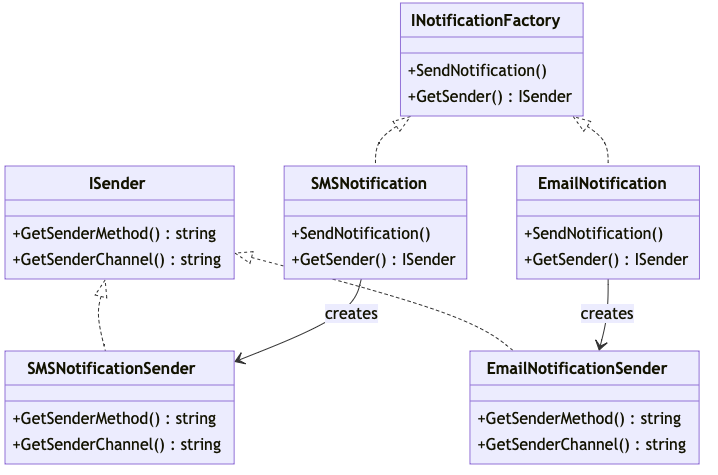

# Abstract Factory

La interfaz fábrica abstracta declara un grupo de métodos que
devuelven distintos productos abstractos. Estos productos se
denominan familia y están relacionados por un tema o concepto
de alto nivel. Normalmente, los productos de una familia
pueden colaborar entre sí. Una familia de productos puede
son incompatibles con los productos de otra.

- https://refactoring.guru/es/design-patterns/abstract-factory

